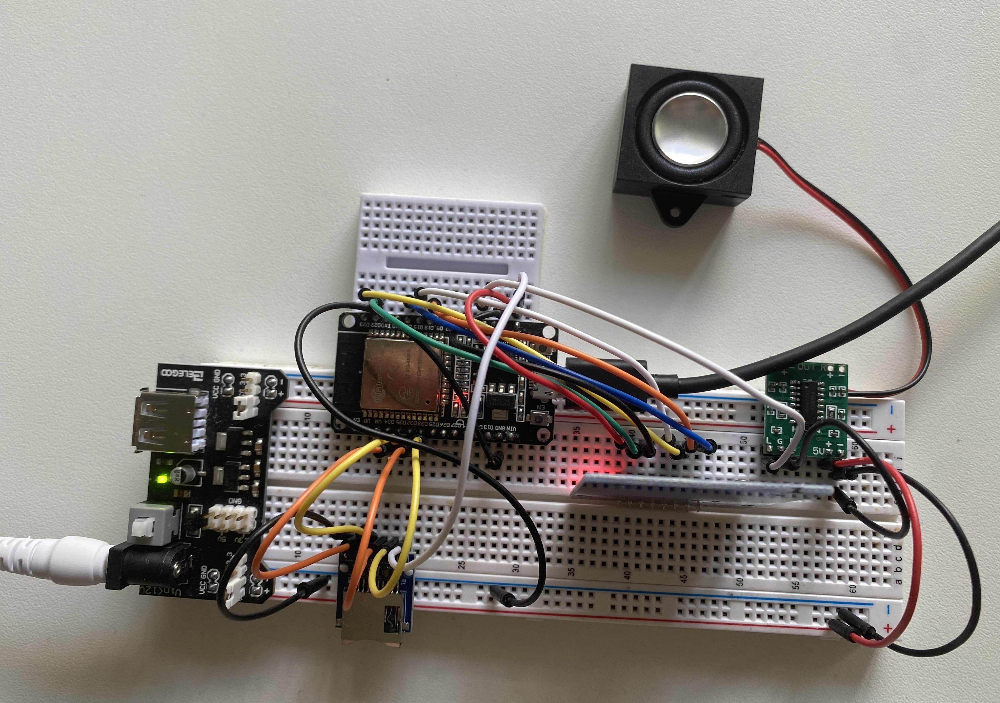

# CueTune

This is the start of an ESP32 music/audio player inspired by [PhonieBox](https://github.com/MiczFlor/RPi-Jukebox-RFID)

## Progress
Have simple server to read/write rfid data. Speaker also wired to beep when rfid tapped.

NOTE: Will probably want to turn webserver into websocket.

## 1. Prerequisites 

### a. Aquire Materials

| Name                                                       | Units        |
|------------------------------------------------------------|--------------|
| ESP32-WROOM-32D                                            | 1            |
| USB Micro Data Cables                                      | 1            |
| RFID-RC522                                                 | 1            |
| RFID Card/Chip                                             | At least 1   |
| 8 ohm (3 watt) Speaker                                     | 1            |
| PAM8403 Digital Amplifier                                  | 1            |
| MB Power Supply Module                                     | 1            |
<!-- | Micro SD SDHC TF Card  Reader                              | 1            | -->

### b. Install required software
Make sure you have the Arduino IDE. You may also need to install a UART Driver if the Arduino IDE does not recognize your ESP32 in Step 1c.

* [Arduino IDE](https://www.arduino.cc/en/software)

* [UART Driver](https://www.silabs.com/developer-tools/usb-to-uart-bridge-vcp-drivers?tab=downloads)
    * On Windows, download/extract CP210x VCP Windows and run CP210xVCPInstaller_x64. 
    * On Mac, download/extract CP210x VCP Mac OSX Driver and run SiLabasUSBDriverDisk.dmg
    * On Ubuntu, you should not need a driver.

## 2. Wiring
While wiring, make sure the ESP32 is not connected to power (including usb).

To wire the RFID to the ESP32, follow the wire diagram [here in Step 6](https://www.instructables.com/ESP32-With-RFID-Access-Control/). You can skip wiring of the LEDs. Note, the  ESP32 numbers are the 'D' numbers found on your board (18 means D18). 

<!-- To wire the SD Card reader to the ESP32, follow the wiring diagram [here under "ESP32 with microSD Card Module- Schematic Diagram"](https://randomnerdtutorials.com/esp32-microsd-card-arduino/) -->

Solder the speaker's red wire to to the amplifier's L(eft) "+" and the black wire to the amplifier's L(eft) "-". Wire the amplifier's 5V "+" to the 5V "+" of the power supply and wire the 5V "-" to the 5V "-" of the power supply. Wire the amplifier's "G" to the same "-". Wire the amplifier's "L" to D2.

### 3. Setup Arduino IDE
In the Arduino IDE, go to Tools > Board > Board Manger. Type in ESP32 and install esp32 by Espressif.  

Now plug in the ESP32 to your computer and click on the new port that is added under "Select Board" on the top bar. A window with “Select Other Board and Port” should pop up. Under boards, filter and select “ESP32-WROOM-DA Module”. Then click okay.

Go to library (book symbol on left bar) and search for and install the following libraries:
* MFRC522 by GithubCommunity
* ArduinoJson by Benoit Blanchon

## 4. Running
To run this code, make sure the ESP32 is connected, open this repo in the Arduino IDE, and press Verify (the check) and Upload (the arrow).

Once the upload is complete, you can connect the ESP32 webserver by using another device (smartphone, computer, etc) to connect to the "CueTune" network. The password is "password" (I know, very secure :P). Once that device is connected (it is normal for this to take a while), use a webrowser to navigate to 192.168.1.2 where you can access the simple website called "Cue Tune".

## Troubleshooting
* Arduino Serial Monitor/Plotter Error: `command 'open' failed: Permission denied. Cood not connect to <YOUR_PORT> serial port.`
    * Ubuntu Solution: Run `sudo chmod a+rw <YOUR_PORT>` (example: `sudo chmod a+rw /dev/ttyUSB0`)

*  `ModuleNotFoundError: No module named 'serial'`
    * Ubuntu solution: Run `pip install pyserial`

* `error: ordered comparison of pointer with integer zero ('byte*' {aka 'unsigned char*'} and 'int') if (backData && (backLen > 0))`
    * Ubuntu Solution: See [this comment](https://github.com/miguelbalboa/rfid/issues/371#issuecomment-2139559806)

## Resources
* ESP32
    * Setup: https://randomnerdtutorials.com/getting-started-with-esp32/
    * Pinout: https://www.electronicshub.org/wp-content/smush-webp/2021/02/ESP32-Pinout-1.jpg.webp
* RFID
    * https://www.instructables.com/ESP32-With-RFID-Access-Control/
    * https://github.com/miguelbalboa/rfid
    * https://github.com/miguelbalboa/rfid/blob/master/examples/ReadAndWrite/ReadAndWrite.ino
* SD Card
  * https://randomnerdtutorials.com/esp32-microsd-card-arduino/

